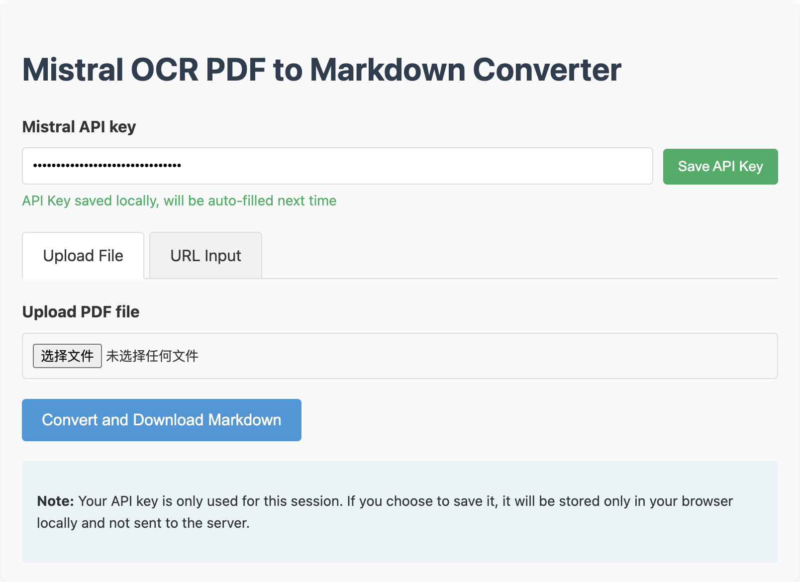

# mistral-ocr-app
Python code &amp; Cloudflare worker for Mistral-OCR

## Python code 
```bash
conda create -y -n mistral-ocr python=3.12
conda activate mistral-ocr
pip install mistralai -i https://pypi.org/simple
python main.py --pdf demo.pdf
```

## Cloudflare worker js code
Copy all code of index.js to Cloudflare worker is OK.

